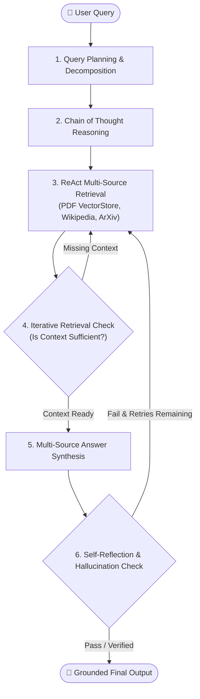

# 🤖 Module 13: Autonomous RAG (Retrieval-Augmented Generation)

## 📌 Overview

**Autonomous RAG** is an advanced AI architecture where the agent operates with complete autonomy — planning, retrieving, reflecting, synthesizing, and iteratively correcting its output without human intervention.

---

## 🏗️ Core Architecture & Flow (from `78-83-Autonomousrag.pdf`)

---

## 📊 Agentic RAG vs Autonomous RAG

| Concept | Agentic RAG | Autonomous RAG |
| :--- | :--- | :--- |
| **Definition** | A RAG system using an agent where LLM reasons and uses tools. | A RAG system that operates independently with full self-management of planning, retrieving, reflection, and improvement. |
| **Focus** | Structured reasoning & tool usage (ReAct, LangGraph). | Complete autonomy in task execution, retries, and continuous reflection. |
| **Behavior** | `Think` $\rightarrow$ `Act` $\rightarrow$ `Observe` $\rightarrow$ `Answer` | `Think` $\rightarrow$ `Act` $\rightarrow$ `Reflect` $\rightarrow$ `Retry` $\rightarrow$ `Synthesize` $\rightarrow$ `Answer` |
| **Retry Logic** | Optional / mostly static plans | Built-in retry / refine strategies (context + answer reflection) |
| **Self-Reflection** | Optional add-on | **Core feature**: reflects on retrieval relevance and groundedness |
| **Planner** | Often manual or basic prompt | **Always present**: breaks complex queries into sub-questions |
| **Tool Use** | Uses static set of tools | Selects and adapts multi-source tools dynamically based on reasoning |

---

## 📂 Notebooks in this Module

1. **[3-COTRag.ipynb](file:///d:/Udemy/Rag_krish%20naik/13_Autonomous_rag/3-COTRag.ipynb)**: Chain-of-Thought reasoning integrated into RAG pipelines.
2. **[4-Selfreflection.ipynb](file:///d:/Udemy/Rag_krish%20naik/13_Autonomous_rag/4-Selfreflection.ipynb)**: Self-reflection and hallucination checking nodes.
3. **[5-QueryPlanningdecomposition.ipynb](file:///d:/Udemy/Rag_krish%20naik/13_Autonomous_rag/5-QueryPlanningdecomposition.ipynb)**: Query planning and structured decomposition into sub-questions.
4. **[6-Iterativeretrieval.ipynb](file:///d:/Udemy/Rag_krish%20naik/13_Autonomous_rag/6-Iterativeretrieval.ipynb)**: Iterative retrieval loops and query refinement.
5. **[7-answersynthesis.ipynb](file:///d:/Udemy/Rag_krish%20naik/13_Autonomous_rag/7-answersynthesis.ipynb)**: Multi-source answer synthesis (PDFs, Wikipedia, YouTube, ArXiv).
6. **[8-Autonomous_RAG.ipynb](file:///d:/Udemy/Rag_krish%20naik/13_Autonomous_rag/8-Autonomous_RAG.ipynb)**: 🌟 **Master Notebook** — Complete end-to-end Autonomous RAG LangGraph workflow integrating all components.
